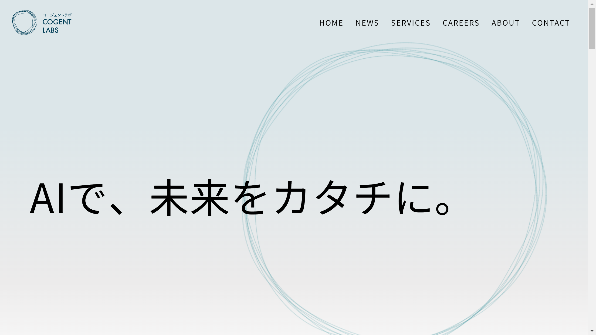

# Cogent Labs

Cogent Labs is an AI company offering SmartRead, an AI-OCR platform for document recognition, classification, and handwriting digitization with 99.2% accuracy.

## Overview

Founded in 2014 and headquartered in Tokyo, Cogent Labs develops AI-powered document processing solutions. The company employs approximately 51-66 people from over 20 countries and has raised $42.7-48.4M across multiple funding rounds from investors including NTT Finance, 1Q Agile Lab, AIZAWA Investments, and Comture. Cogent Labs serves industries requiring handwriting recognition and document digitization.

## Key Features

- **SmartRead AI-OCR**: Document recognition platform achieving 99.2% accuracy for both printed and handwritten text
- **Automatic Classification**: Independent AI engine for document sorting with built-in classification functionality
- **SmartVerify**: Verification and correction function reducing data conversion time by 90%
- **Definition-Less Reading**: Processes non-structured documents without requiring pre-defined templates or coordinates
- **Tegaki Service**: Handwriting recognition technology with continuous learning to improve accuracy
- **GPU-Free Deployment**: Operates on existing private clouds or virtual environments without GPU requirements

## Use Cases

### Handwritten Document Digitization
Organizations deploy SmartRead to convert handwritten forms and documents into digital text. The platform achieves 99.2% recognition accuracy across various industries, processing both structured forms and unstructured handwritten content. The Tegaki service continuously learns from input to improve accuracy over time.

### Multi-Document Classification and Reading
Back-office operations use SmartRead to automate document classification, reading, and data export in a single workflow. The platform's independent AI engine sorts documents by type, extracts data with high precision, and exports to target systems without manual intervention.

### Verification and Correction
Data entry teams leverage SmartVerify to validate and correct OCR results. The function reduces data conversion time by 90% by streamlining the review process for extracted information, particularly for handwritten and complex documents.

## Technical Specifications

| Feature | Specification |
|---------|---------------|
| Core Products | SmartRead, SmartVerify, Tegaki |
| Recognition Accuracy | 99.2% for documents |
| Document Types | Structured, non-structured, handwritten |
| AI Technology | Independent AI engine, continuous learning |
| Template Requirements | None (definition-less reading) |
| Deployment | Cloud, on-premises (SmartRead On-Premises) |
| Infrastructure | No GPU required, private cloud compatible |
| Processing | Automated classification, reading, data export |

## Resources

- [Website](https://www.cogent.co.jp/)
- [SmartRead Product Page](https://aismiley.co.jp/product/smartread/)

## Company Information

Headquarters: Tokyo, Japan (3-2-1 Roppongi, Minato-ku, 36th floor Sumitomo Fudosan Roppongi Grand Tower)

Founded: 2014

Employees: 51-66 (from over 20 countries)

Funding: $42.7-48.4M total (NTT Finance, 1Q Agile Lab, AIZAWA Investments, Comture)
