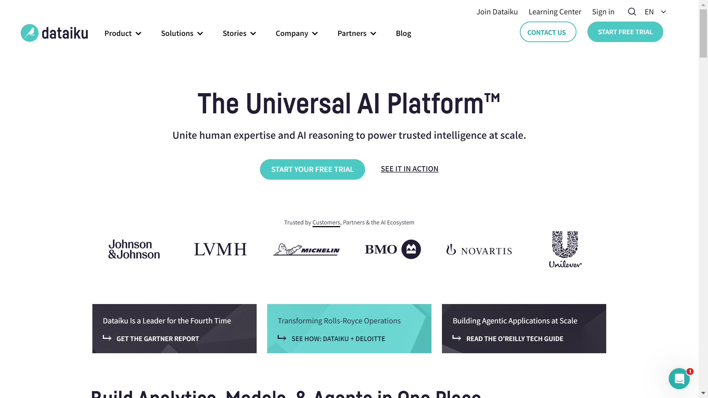

# Dataiku

Dataiku is a universal AI platform offering document intelligence capabilities through its data science and machine learning platform with intelligent document processing plugins for text extraction and analysis.

## Overview

Founded in 2013 in Paris, Dataiku provides an enterprise AI and data science platform that includes intelligent document processing capabilities. Valued at $4.6 billion after its Series E in 2021, the company serves over 1,000 global clients with a platform for building, deploying, and managing data, analytics, and AI projects. Dataiku's document processing features support extracting and analyzing content from PDFs, images, and various file formats through integrated computer vision, NLP, and vision-language models.

## Key Features

- **Natif.ai IDP Plugin**: Processes documents (PDF, TIFF, JPEG) into structured data using computer vision, deep learning, and [NLP](../../capabilities/natural-language-processing/index.md)
- **Modular Document Pipeline**: Accepts document corpus, digitizes content, [extracts text](../../capabilities/extraction/index.md), consolidates into searchable database, and applies NLP analysis
- **VLM and LLM Integration**: Seamlessly extracts and embeds information from text, tables, and images using vision-language models
- **Structured Extraction**: Processes diverse file types with enhanced document understanding in Version 14.0
- **Interactive Document Intelligence**: TL;DR features for ESG and other document-intensive workflows
- **Universal AI Platform**: Integrates document processing within broader data science and machine learning workflows

## Use Cases

### ESG Document Analysis
Organizations use Dataiku's interactive document intelligence for ESG reporting and compliance. The platform processes sustainability reports, regulatory filings, and disclosure documents, applying [NLP](../../capabilities/natural-language-processing/index.md) to categorize, analyze, and extract ESG metrics.

### Enterprise Document Corpus Processing
Companies deploy Dataiku's modular pipeline to digitize and analyze large document collections. The system converts native and scanned images to text, builds searchable databases, and applies multiple NLP techniques for categorization and insight extraction.

### Multi-Modal Data Extraction
Teams leverage vision-language models to extract information from complex documents containing text, tables, and images. The platform processes structured and unstructured content in a single workflow, embedding extracted data for downstream analytics and AI applications.

## Technical Specifications

| Feature | Specification |
|---------|---------------|
| Core Platform | Dataiku Data Science Studio (DSS), Universal AI Platform |
| Document Processing | Natif.ai IDP plugin, modular pipeline |
| Technologies | Computer vision, deep learning, NLP, VLMs, LLMs |
| File Formats | PDF, TIFF, JPEG, diverse file types |
| Processing Steps | Digitization, text extraction, database consolidation, NLP analysis |
| Integration | Part of end-to-end data science and AI workflow |
| Deployment | Cloud, on-premises |
| Version Features | Enhanced structured extraction (v14.0) |

## Resources

- [Website](https://www.dataiku.com/)
- [Natif IDP Plugin](https://www.dataiku.com/product/plugins/natif-idp/)
- [Document Intelligence Blog](https://blog.dataiku.com/interactive-document-intelligence-esg)
- [Knowledge Base](https://knowledge.dataiku.com/latest/)

## Company Information

Headquarters: Paris, France (US HQ: New York City)

Founded: 2013

Offices: New York, Denver, Washington DC, Los Angeles, Paris, London, Munich, Frankfurt, Sydney, Singapore, Tokyo, Dubai

Funding: $4.6B valuation (Series E, 2021), $200M Series F (2022)
