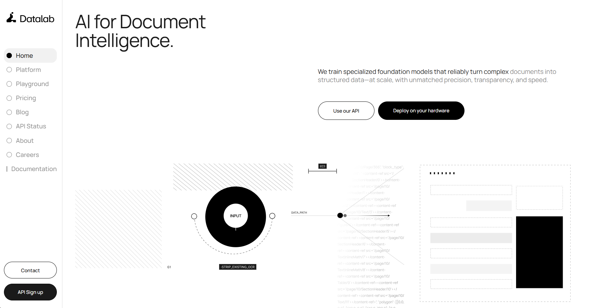

# Datalab

Datalab develops state-of-the-art foundation models for document intelligence, offering lightning-fast PDF-to-markdown conversion with industry-leading accuracy for 90+ languages.

## Overview

Datalab is a cutting-edge AI company specializing in document intelligence foundation models that transform complex documents into structured data with unmatched precision, transparency, and speed. Based in Manhattan's Financial District, the company has developed a comprehensive suite of open-source and commercial solutions that convert PDF, image, PPTX, DOCX, XLSX, HTML, EPUB files in all languages into machine-readable formats.

At the core of Datalab's offering is [Marker](https://github.com/datalab-to/marker), their flagship PDF-to-markdown conversion tool that benchmarks favorably compared to cloud solutions while maintaining open-source accessibility. The platform combines multiple specialized AI models for OCR, layout analysis, table detection, and reading order determination to deliver comprehensive document processing capabilities. Datalab's commitment to transparency and open-source development has made their tools widely adopted in the developer community while their commercial APIs serve enterprise customers requiring scalable document processing solutions.

## Key Features

- **Marker PDF Conversion**: Industry-leading PDF-to-markdown conversion that accurately preserves tables, equations, inline math, links, references, and code blocks across multiple document formats
- **Rules API**: Natural language-based correction system that allows users to customize and refine Marker outputs, handling edge cases like merging tables across pages and correcting OCR errors
- **Multi-language OCR**: Advanced optical character recognition supporting 90+ languages, LaTeX equations, handwriting, chemical formulas, and complex mathematical notation
- **Datalab Forge**: Interactive playground for visualizing, testing, and iterating on document processing rules across multiple documents simultaneously
- **Layout Analysis**: Sophisticated document structure recognition that identifies titles, images, equations, tables, and other layout elements with high precision

## Use Cases

### Academic Research Processing
Datalab excels at processing research papers and academic documents, extracting structured information like author names with affiliations, methodologies, and reagent lists from complex scientific PDFs. The platform's superior handling of mathematical equations and LaTeX formatting makes it ideal for STEM document processing.

### Technical Documentation Conversion
Engineering teams use Datalab to convert legacy technical manuals, specifications, and documentation from PDF format into markdown for modern documentation systems. The platform's ability to preserve complex tables and technical diagrams ensures critical information remains intact during conversion.

### Enterprise Document Digitization
Organizations leverage Datalab's APIs to process large volumes of mixed-format documents (PDFs, Word documents, presentations) into structured, searchable formats. The Rules API allows customization for specific document types and organizational standards, while the open-source nature provides transparency and control.

## Technical Specifications

| Feature | Specification |
|---------|---------------|
| Deployment Options | Cloud API, On-premise, Open-source |
| API | REST API with SDK support |
| Supported Languages | 90+ languages including complex scripts |
| Document Formats | PDF, DOCX, PPTX, XLSX, HTML, EPUB, Images |
| Output Formats | Markdown, JSON, HTML, Chunks |
| Special Features | LaTeX, handwriting, chemical formulas |

## Getting Started

Datalab offers multiple entry points for users to explore their document intelligence capabilities:

1. **Public Playground**: Test Marker's capabilities directly in the browser at [datalab.to/playground](https://www.datalab.to/playground)
2. **Open Source**: Download and run Marker locally using the [GitHub repository](https://github.com/datalab-to/marker)
3. **API Access**: Sign up for API access with $5 in free credits upon providing payment details
4. **Datalab Forge**: Experiment with the Rules API in their interactive rule-tweaking environment

For developers, Datalab provides comprehensive documentation and an SDK for easy integration. The platform offers both subscription-based and credit-based pricing models to accommodate different usage patterns.

## Resources

- [Vendor Website](https://www.datalab.to/)
- [Documentation](https://documentation.datalab.to/)
- [GitHub Repository](https://github.com/datalab-to/marker)
- [Public Playground](https://www.datalab.to/playground)
- [Discord Community](https://discord.gg/FgburwjkAh)
- [Company Blog](https://www.datalab.to/blog)

## Contact Information

- Website: [datalab.to](https://www.datalab.to/)
- Email: support@datalab.to
- Discord: [Active community](https://discord.gg/FgburwjkAh) with dedicated #marker channel
- Social: [Twitter/X](https://x.com/datalabto), [LinkedIn](https://www.linkedin.com/company/datalabto)
