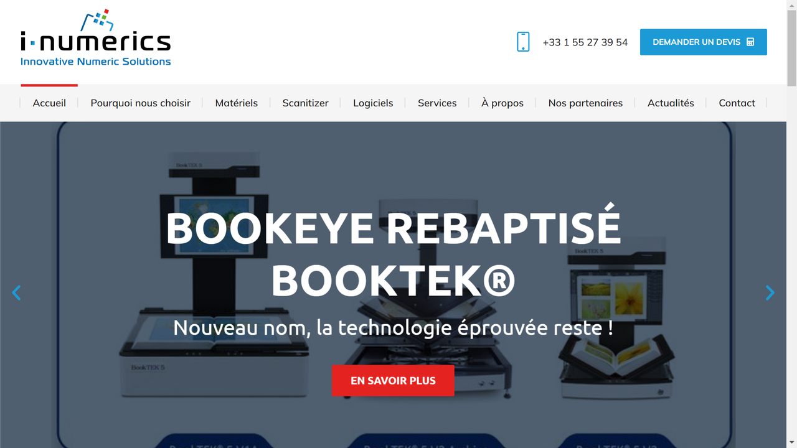

# I-numerics

[I-numerics](https://i-numerics.com/) provides data analytics and business intelligence solutions that help organizations transform their raw data into actionable insights for informed decision-making.

## Overview

I-numerics specializes in business intelligence (BI) and analytics technology that enables organizations to connect to diverse data sources, visualize information, and gain insights for better business decisions. The company offers a comprehensive BI platform designed to make complex data accessible and meaningful for business users without advanced technical expertise.

Based in Germany, I-numerics has developed a reputation for creating user-friendly yet powerful analytics solutions that can address various business intelligence needs across departments and industries. Their platform emphasizes visual analytics, self-service capabilities, and flexibility to adapt to different organizational requirements.

I-numerics serves clients across various sectors including manufacturing, retail, healthcare, and services, with particular strength in German-speaking markets. Their solutions aim to democratize access to data insights, improve decision-making processes, and identify business optimization opportunities through better data understanding.

## Key Features

- **Data Visualization**: Interactive dashboards and reports
- **Self-Service Analytics**: Business user-friendly interface and tools
- **Data Integration**: Connections to multiple data sources and systems
- **Mobile Analytics**: Access to insights on mobile devices
- **Embedded Analytics**: Integration of analytics into business applications
- **Predictive Analytics**: Forward-looking data analysis capabilities
- **Collaborative Features**: Sharing and team-based analysis tools
- **Data Governance**: Control over data access and usage
- **Automated Reporting**: Scheduled distribution of insights
- **Custom KPI Tracking**: Monitoring of critical business metrics

## Use Cases

### Executive Dashboards for Performance Monitoring

Organizations implement I-numerics to create comprehensive executive dashboards that provide real-time visibility into key performance indicators across departments. The solution aggregates data from multiple business systems including ERP, CRM, and financial applications to create a unified view of performance metrics. Executives access interactive visualizations showing sales trends, operational efficiency, financial results, and other critical KPIs through intuitive dashboards that allow drill-down into underlying data. The platform enables data-driven leadership decisions by highlighting performance anomalies, identifying trends, and tracking progress toward strategic objectives.

### Sales Analytics and Territory Management

Sales teams use I-numerics to optimize their sales performance and territory management. The platform analyzes sales data to reveal customer purchasing patterns, product performance, and sales representative effectiveness. Interactive maps and geographic visualizations help managers optimize territory assignments and identify regional opportunities. The system provides predictive analytics to forecast sales trends and recommend focus areas. Sales representatives access personalized dashboards showing their pipeline, quotas, and customer information. This comprehensive sales intelligence helps organizations increase win rates, improve resource allocation, and maximize revenue generation across products and territories.

## Technical Specifications

| Feature | Specification |
|---------|---------------|
| Deployment Options | Cloud, On-premises, Hybrid |
| Data Source Connectors | Databases, ERP systems, CRM, spreadsheets, web services |
| Visualization Types | Charts, graphs, maps, tables, custom visualizations |
| Mobile Support | iOS, Android, responsive web design |
| Integration Capabilities | APIs, embedded analytics, white-labeling options |
| Security Features | Role-based access, data-level security, SSO support |
| Performance | In-memory processing for rapid analysis |
| Scalability | Enterprise-grade for large data volumes |
| Export Options | PDF, Excel, image formats, data exports |
| Administration | Centralized management console |

## Getting Started

1. **Requirements Analysis**: Assessment of analytics needs and use cases
2. **Data Connection**: Integration with relevant data sources
3. **Dashboard Design**: Creation of initial reports and visualizations
4. **User Training**: Education on self-service capabilities
5. **Deployment**: Rollout to business users and departments
