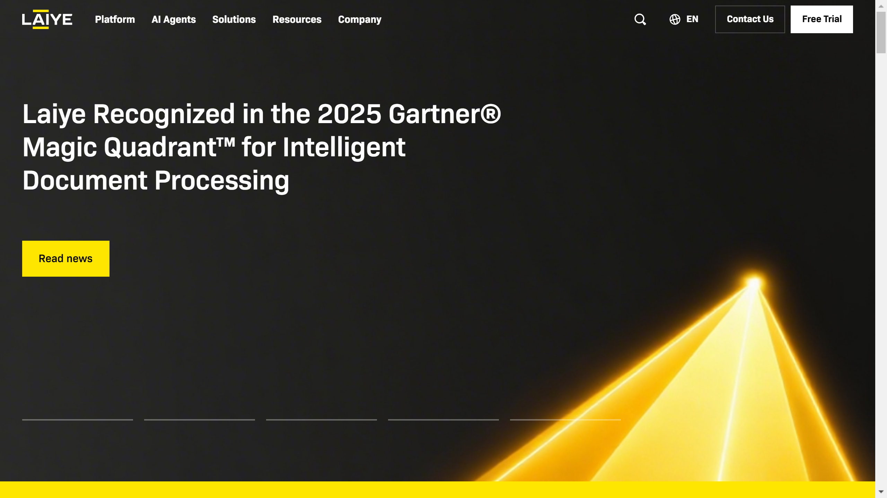

# Laiye

Laiye is a Chinese intelligent automation platform provider specializing in RPA, AI agents, and the Work Execution System framework for enterprise digital workers.

## Overview

Laiye pioneered the Work Execution System, a framework combining human workers with AI-powered digital workers for enterprise automation. Founded in Beijing, Laiye has become China's leading RPA vendor and the only Chinese company recognized in Gartner's Magic Quadrant for Robotic Process Automation for five consecutive years. The company serves one out of every five Fortune Global 500 companies operating in China and maintains a developer community of nearly 800,000 members. Laiye's Work Execution Platform (WEP) integrates RPA, process mining, NLP, conversational AI, text recognition, and image recognition into a unified automation environment.

In April 2021, Laiye closed a $50 million Series C+ funding round, positioning itself as China's answer to UiPath in the intelligent automation market.

## Key Features

- **Work Execution Platform (WEP)**: Unified platform for building and scaling AI agents across enterprise scenarios
- **UiBot Mage**: RPA tool combining automation with AI capabilities
- **AI-Native Architecture**: Self-developed [OCR](../../capabilities/ocr/index.md), NLP, and conversational AI engines
- **Process Mining**: Workflow discovery and optimization capabilities
- **AI Agents (Digital Workers)**: Autonomous software agents for task automation
- **Multi-Technology Integration**: RPA, NLP, conversational intelligence, text recognition, image recognition

## Use Cases

### Enterprise Process Automation

Global companies in China deploy Laiye's platform to automate back-office operations including finance, HR, and customer service processes. The RPA bots handle repetitive tasks while AI agents manage more complex decision-making workflows. Organizations use process mining to identify automation opportunities before deploying digital workers.

### Conversational AI and Customer Service

Enterprises implement Laiye's conversational intelligence capabilities for customer interaction automation. The NLP-powered systems handle inquiries, route requests, and provide information through chatbots and virtual assistants integrated with RPA workflows for end-to-end service delivery.

### Document Processing

Organizations use Laiye's self-developed OCR and image recognition technologies to automate document-intensive processes. The platform extracts data from forms, invoices, and contracts, combining recognition accuracy with RPA for downstream system integration.

## Technical Specifications

| Feature | Specification |
|---------|---------------|
| Core Platform | Work Execution Platform (WEP) |
| RPA Product | UiBot Mage |
| AI Technologies | OCR, NLP, conversational AI, image recognition |
| Additional Capabilities | Process mining, AI agents |
| Market Position | Gartner RPA Magic Quadrant (5 consecutive years) |
| Developer Community | ~800,000 members |
| Enterprise Customers | 20% of Fortune Global 500 companies in China |
| Geographic Coverage | China (nationwide sales network) |

## Resources

- [Website](https://laiye.com/en)
- [Documentation](https://laiye.com/en)

## Company Information

**Headquarters**: Beijing, China

**Funding**: $50 million Series C+ (April 2021)

**Recognition**: Gartner Magic Quadrant for RPA (5 consecutive years, only Chinese company)

**Market Position**: Leader in IDC MarketScape China RPA Software assessment
