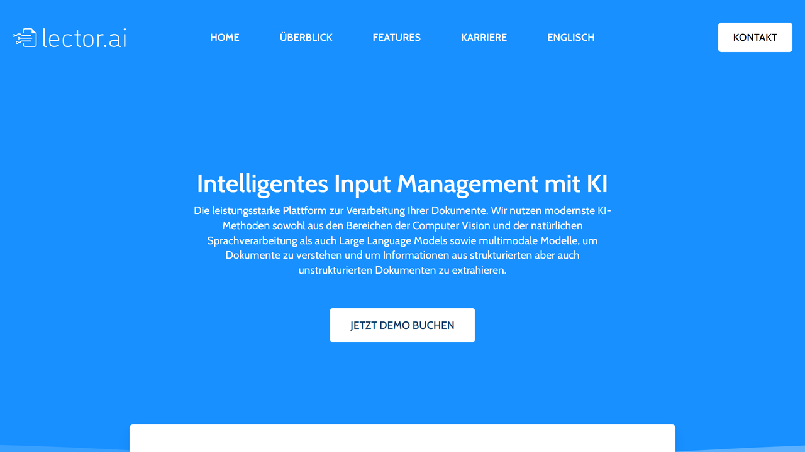

# Lector.ai  
  
Lector.ai provides AI-driven solutions for document intelligence, enabling businesses to automate data extraction, content analysis, and information processing with speed and accuracy.  

## Overview  
Founded in 2020, Lector.ai is a dynamic provider of intelligent document processing (IDP) solutions, leveraging state-of-the-art AI and machine learning technologies. The platform focuses on automating the conversion of unstructured documents into structured and actionable data that drives business optimization. Key industries served include banking, legal, insurance, and manufacturing, where the need for quick and accurate data processing from documents is critical.  

Lector.ai provides seamless integration with common enterprise platforms and ensures compliance with data protection regulations through its robust security capabilities. By enhancing workflows and eliminating manual data entry, Lector.ai helps businesses save time, reduce errors, and increase productivity.  

## Key Features  
- **AI-Based Data Extraction**: Automates the extraction of key information from unstructured documents, including tables, forms, and free text.  
- **Natural Language Processing (NLP)**: Understands and processes textual content for tasks like classification, summarization, and entity recognition.  
- **Multi-Language Support**: Processes documents in over 30 languages, making it suitable for global organizations.  
- **Custom Workflows**: Enables businesses to design bespoke workflows to automate industry-specific processes.  
- **GDPR-Compliant Security**: Ensures data security and regulatory compliance for handling sensitive information.  

## Use Cases  
### Invoice and Procurement Automation  
Lector.ai simplifies accounts payable workflows by extracting line items and payment data from invoices and integrating directly into ERP systems.  

### Legal Document Analysis  
Law firms use Lector.ai to identify and extract important clauses, dates, and obligations from contracts and other legal documents.  

### Insurance Claims Processing  
Insurance companies rely on Lector.ai to process claims faster by automating the extraction of policy details, claim amounts, and other essential data.  

### Manufacturing Workflow Optimization  
Manufacturers use Lector.ai to digitize and process order forms, supply chain documents, and performance reports for improved operational efficiency.  

## Technical Specifications  

| Feature              | Specification                         |  
|----------------------|---------------------------------------|  
| Deployment Options   | Cloud, On-Premises, Hybrid            |  
| Supported File Types | PDF, Word, Excel, Scanned Documents   |  
| Supported Languages  | 30+ (e.g., English, German, French, Spanish, etc.) |  
| Integrations         | APIs for ERP, CRM, and proprietary platforms |  

## Getting Started  
Lector.ai ensures a rapid and efficient implementation process:  
1. Begin with a consultation to identify document processing challenges and goals.  
2. Configure Lector.ai’s platform to meet document types and workflow requirements.  
3. Train the system on existing datasets or live documents for optimal accuracy.  
4. Deploy and integrate the platform with enterprise systems like ERP or CRM platforms using APIs.  
5. Evaluate output and fine-tune rules or processes as needed.  
6. Access ongoing support for scaling and system enhancement.  

## Resources  
- [Vendor Website](https://www.lector.ai/)  
