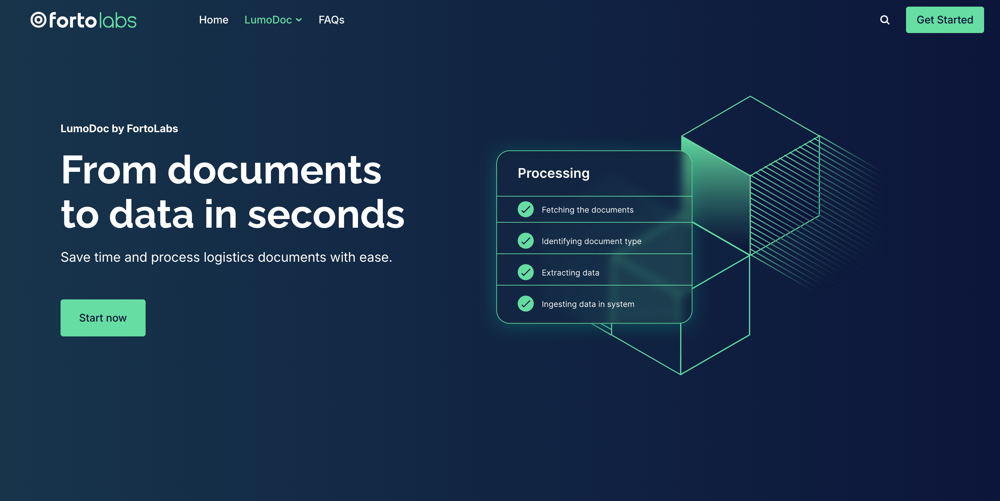

# LumoDoc by FortoLabs

LumoDoc is an advanced, Agentic AI-powered Intelligent Document Processing (IDP) solution engineered for high-precision data extraction and workflow automation across the global logistics industry.



## Overview

LumoDoc is deployed by [FortoLabs](https://fortolabs.com/lumodoc/), the dedicated Software-as-a-Service (SaaS) platform by [Forto](https://forto.com/). Forto, a digital freight forwarder founded in 2016, launched FortoLabs in October 2025 to commercialize its validated in-house AI technologies for the broader logistics and supply chain market.

The platform is fundamentally trained on proprietary, logistics-specific data sets to ensure maximum classification and extraction accuracy against complex logistics documentation. LumoDoc handles end-to-end processing, from automatically ingesting inbound documents to initiating data processing pipelines and synchronizing with downstream systems.

## Key Features

- **Agentic AI Identification**: Semantic understanding of documents enabling accurate classification of all freight documentation, including handwritten formats.

- **API-First Integration**: Seamless automated data synchronization with systems like TMS, ERP, and WMS using robust, secure API calls.

- **Email-to-System Automation**: Automatic ingestion of inbound documents and attachments to initiate processing. Capability to reply the same email with results.

- **High-Precision Extraction**: Proprietary AI models capture data with a multi-tier validation engine checking against customer records and global datasets.

- **Human-in-the-Loop (HITL)**: Built-in workflows for effortless exception handling and final human confirmation of sensitive documents.

- **Compliance**: Architecture and data handling processes are fully GDPR compliant.

- **Cloud-Native Deployment**: Delivered as a fully scalable, high-availability SaaS solution.

## Use Cases

### Freight Invoice Automation (AP)

LumoDoc automatically processes incoming freight invoices, extracting critical data points (e.g., freight charges, line items) and validating the information before syncing it to accounting or enterprise resource planning (ERP) systems. This is designed to eliminate manual data entry errors and accelerate payment cycles.

### Customs Document Processing

The solution supports complex customs documents, ensuring that key information required for brokerage and compliance is extracted accurately and quickly. LumoDoc helps reduce processing time for customs clearance, mitigating shipment delays.

### Automating Freight Forwarding Operations

LumoDoc automates the processing of booking confirmations, packing lists, commercial invoices, and related communications. It extracts key logistics parameters (e.g., vessel name, booking number, cutoff dates, and weights) and updates internal Transport Management Systems (TMS) instantaneously.

## Technical Specifications


| Feature | Specification |
|---------|---------------|
| Deployment Options | Cloud-based SaaS |
| API | RESTful APIs|
| Document Types | 15+ Logistics Documents (Bills of Lading, Customs Declarations, etc.) |
| AI Technology | Agentic AI, GenAI-powered models |
| Supported Languages | All Latin alphabet-based scripts |
| Document Formats | PDF, TIFF, PNG, JPEG, XML |
| Output Format | CSV, XML, JSON, structured data |
| Data Ingestion| API, Direct DB, SMTP |
| Accuracy | Over 95% on average |
| Scalability | Enterprise-grade, high-volume capability |
| Target Industries | Logistics, Supply Chain Management, Freight Forwarding |


## Getting Started

1. **Ingestion Setup**: Configure data intake via API, Direct DB, or SMTP email forwarding.

2. **Integration**: Connect LumoDoc to your TMS, ERP, or WMS systems.

3. **Processing**: Agentic AI classifies and extracts data from incoming freight documents.

4. **Validation**: Automated checks against global datasets and optional Human-in-the-Loop review.

5. **Sync**: Validated data is pushed instantaneously to downstream systems.


## Contact Information

```Jorge Jungclaus```
- Senior Sales Manager
- Email: jorge.jungclaus@fortolabs.com
- Phone: +49 40 808117830
- Website: [lumodoc](https://fortolabs.com/)


```Siddhant Verma```
- Sales Development Representative
- Email: siddhant.verma@fortolabs.com
- Phone: +49 40 808134244
- Website: [lumodoc](https://fortolabs.com/)
