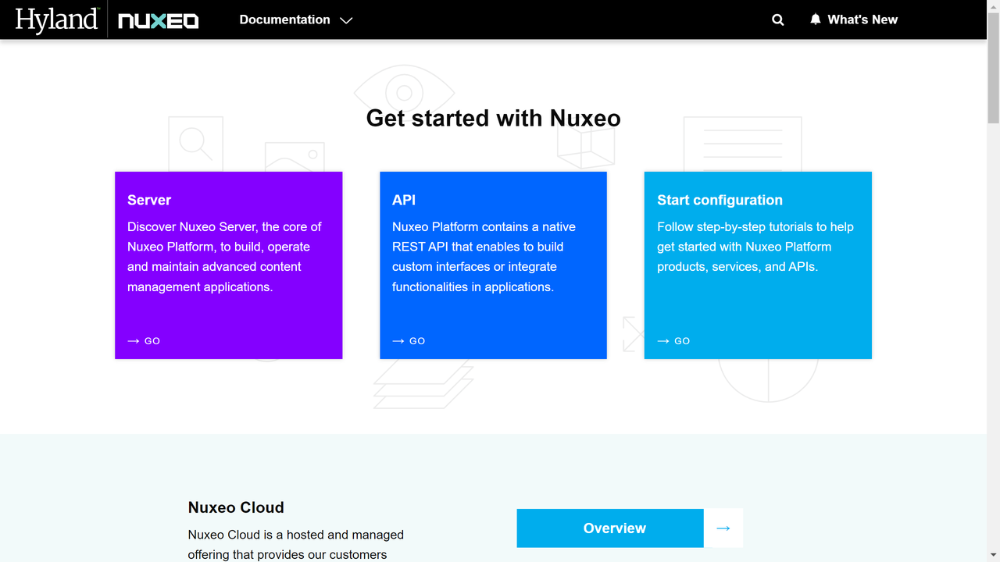

# Nuxeo

Nuxeo, now part of Hyland, is an open and extensible content services platform designed to manage complex digital assets and enterprise content with native cloud capabilities, powerful workflow automation, and advanced AI integration.

## Overview

Nuxeo provides a modern, cloud-native content services platform built to manage complex digital assets and business content across the enterprise. The platform combines document management, digital asset management (DAM), case management, and business process automation in a flexible, API-first architecture.

Founded in 2000 and acquired by Hyland in 2021, Nuxeo has established itself as an innovative provider of content services technologies. Their platform is distinguished by its microservices architecture, scalability, and extensive customization capabilities, making it particularly well-suited for organizations with complex content needs and development resources.

Nuxeo serves enterprises across various industries, including financial services, government, manufacturing, media and entertainment, and retail. Their solutions help these organizations manage critical business content, streamline content-centric processes, and derive greater value from their information assets through intelligent automation and analytics.

## Key Features

- **Document Management**: Enterprise content organization and control
- **Digital Asset Management**: Rich media management and distribution
- **Case Management**: Information-centric process coordination
- **Workflow Automation**: Flexible business process design
- **Intelligent Metadata**: AI-enhanced content categorization
- **Cloud-Native Architecture**: Containerized, microservices design
- **API-First Approach**: Comprehensive REST API and integration capabilities
- **Low-Code Configuration**: Studio visual configuration tools
- **Advanced Search**: Elasticsearch-powered content discovery
- **AI & Machine Learning**: Intelligent content services

## Use Cases

### Digital Asset Management

Media and marketing organizations implement Nuxeo as their digital asset management solution to centralize and optimize creative content workflows. The platform ingests, organizes, and processes diverse media types including images, videos, 3D files, and compound assets like InDesign packages. Powerful metadata capabilities enable precise tagging using both manual and AI-assisted methods, while version control maintains the complete history of each asset. Workflow automation streamlines creative review cycles with customizable approval paths and annotation tools. Integration with creative tools (Adobe Creative Cloud, Figma) allows users to access and contribute assets without leaving their preferred applications. The platform's powerful rendering engine automatically generates appropriate derivatives for different channels and devices. This implementation accelerates time-to-market for campaigns, ensures brand consistency through controlled asset distribution, reduces production costs through asset reuse, and provides actionable insights on asset performance and usage.

### Enterprise Content Management at Scale

Large organizations utilize Nuxeo to manage high-volume, complex content repositories with strict compliance requirements. The platform's microservices architecture supports billions of documents with millisecond response times, while the Elasticsearch backend enables advanced search across massive content stores. Classification services automatically categorize incoming documents using machine learning models trained on organizational taxonomies. Records management capabilities enforce retention policies and legal holds based on content type and regulatory requirements. Integration with enterprise systems creates a unified information ecosystem while federation services connect to legacy repositories. Audit trails and permission models ensure regulatory compliance with GDPR, CCPA, and industry-specific regulations. This approach transforms information access through powerful search capabilities, reduces compliance risk through automated governance, improves decision-making through contextual information delivery, and future-proofs content infrastructure through a flexible, extensible architecture.

## Technical Specifications

| Feature | Specification |
|---------|---------------|
| Architecture | Cloud-native, microservices, containerized |
| Deployment Options | Cloud, on-premises, hybrid |
| Scalability | Horizontally scalable, supports billions of documents |
| Search Technology | Elasticsearch-based with configurable facets |
| Content Store | Pluggable storage with cloud and on-premises options |
| Integration Methods | REST API, Java API, JavaScript, .NET, PHP clients |
| Workflow Engine | BPMN 2.0 compatible process automation |
| UI Framework | Web Components, responsive design |
| Metadata Management | Flexible schema, inheritance, AI enrichment |
| Security Features | Fine-grained permissions, encryption, auditing |

## Getting Started

1. **Discovery**: Assessment of content and process requirements
2. **Solution Design**: Architecture planning based on business needs
3. **Development**: Configuration and customization using Nuxeo Studio
4. **Integration**: Connection with existing enterprise systems
5. **Deployment**: Implementation with ongoing optimization

## Resources

- [Documentation](https://doc.nuxeo.com/)
- [Github](https://github.com/nuxeo/nuxeo)

## Contact Information

- Website: [hyland.com/en/platform/product-suite/nuxeo-platform](https://www.hyland.com/en/platform/product-suite/nuxeo-platform)
