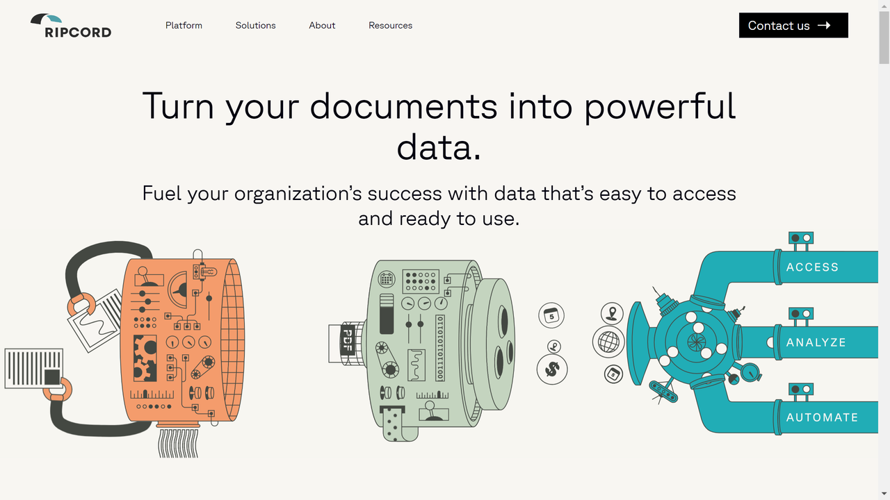

# Ripcord

Ripcord is a robotics company that combines hardware automation, computer vision, and artificial intelligence to deliver high-speed document digitization, classification, and data extraction services through its innovative robotic digitization platform.

## Overview

Ripcord provides a robotic approach to document management and digitization services, offering a comprehensive solution that transforms physical records into searchable, accessible digital content. Their technology combines automated document scanning with intelligent content processing to streamline records management.

Founded in 2015, Ripcord has revolutionized traditional document scanning with its robotic systems that automatically handle, scan, and process paper records at high speed and accuracy. The company's end-to-end solution includes both the physical digitization of documents and the intelligent extraction and organization of the information they contain.

Ripcord serves organizations across multiple industries, including financial services, healthcare, government, legal, and manufacturing. Their solutions help enterprises eliminate paper-based processes, improve information accessibility, reduce storage costs, and accelerate digital transformation initiatives while maintaining security and compliance.

## Key Features

- **Robotic Document Scanning**: Automated physical handling and high-speed digitization
- **Intelligent Data Extraction**: AI-powered recognition and classification of content
- **Document Classification**: Automatic categorization and organization
- **Records Management**: Secure digital storage with metadata enhancement
- **Content Searchability**: Full-text search across digitized records
- **API Integration**: Connections with enterprise systems
- **Security & Compliance**: Advanced protection of sensitive information
- **Analytics**: Insights into document usage and processes
- **Chain of Custody**: Complete tracking of documents through digitization
- **Cloud Access**: Secure retrieval of digitized content

## Use Cases

### Enterprise Records Digitization

Organizations implement Ripcord's robotic scanning technology to transform massive archives of physical records into searchable digital content. The system processes boxes of documents at industrial scale, automatically removing staples and preparing materials for scanning without manual intervention. Using computer vision and AI, the platform identifies document types, extracts critical metadata, and organizes content into a logical structure that mirrors business processes. The resulting digital repository provides secure access to authorized users through role-based permissions while maintaining strict chain of custody documentation for compliance purposes. This approach accelerates digitization projects by up to 10x compared to traditional methods, dramatically reduces costs associated with physical storage, enables instant retrieval of information that previously took days to locate, and improves security through encryption and access controls that weren't possible with paper records.

### Mortgage Processing Automation

Financial institutions utilize Ripcord to streamline mortgage application processing and documentation. The solution digitizes incoming loan applications and supporting documents at high speed, automatically classifying different document types (income verification, tax returns, property assessments) and extracting relevant data points. Integration with loan origination systems enables direct transfer of extracted information, eliminating manual data entry and reducing errors. The system maintains a complete digital record of all mortgage documentation, accessible through a secure cloud platform that enables collaborative review by underwriters, processors, and compliance teams. This implementation reduces mortgage processing time from weeks to days, improves accuracy through elimination of manual data entry, enhances compliance through consistent document handling and complete audit trails, and accelerates decision-making through immediate access to all relevant loan information regardless of physical location.

## Technical Specifications

| Feature | Specification |
|---------|---------------|
| Scanning Speed | Up to 600 pages per minute per robot |
| Document Handling | Automatic paper preparation, staple removal |
| Recognition Technology | Computer vision, machine learning, OCR |
| Data Extraction | Structured and unstructured information |
| File Formats | PDF, PDF/A, TIFF, JPEG, XML, and more |
| Security | SOC 2 compliance, encryption, access controls |
| Integration Methods | RESTful APIs, customizable connectors |
| Deployment Model | Ripcord scanning centers or on-premises |
| Cloud Platform | Secure, scalable content repository |
| Compliance Support | GDPR, HIPAA, SEC, FINRA, and industry-specific regulations |

## Getting Started

1. **Records Assessment**: Evaluation of document volumes and types
2. **Project Planning**: Customized digitization strategy development
3. **Preparation**: Organization and delivery of physical records
4. **Digitization**: Robotic scanning and intelligent processing
5. **Knowledge Activation**: Deployment of digital content platform

## Resources

- [Company Website](https://www.ripcord.com/)
