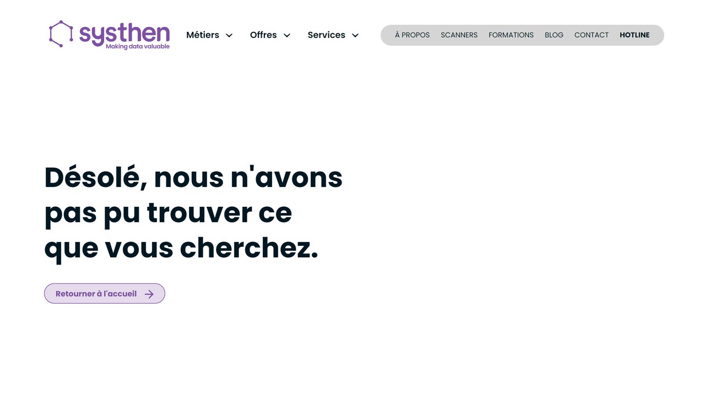

# Systhen

Systhen provides Enterprise Content Management (ECM) and document management solutions designed to help organizations efficiently capture, store, manage, and deliver business-critical information.

## Overview

Systhen offers document management and content services platforms that enable organizations to transform their information management practices. Their solutions address the full spectrum of content lifecycle management, from capture and creation to archiving and disposition.

Based in Belgium, Systhen has developed ECM solutions that combine traditional document management capabilities with modern content services approaches. Their technology integrates document management, workflow automation, and collaboration tools to provide comprehensive information management solutions that adapt to evolving business needs.

Systhen serves organizations across various industries looking to improve operational efficiency, enhance compliance, and facilitate digital transformation through better content management. Their solutions are particularly valuable for document-intensive sectors such as financial services, healthcare, manufacturing, and public administration.

## Key Features

- **Document Capture**: Digitization and ingestion of physical and electronic documents
- **Content Repository**: Centralized, secure storage for all business content
- **Metadata Management**: Flexible classification and tagging of documents
- **Version Control**: Document history tracking and version management
- **Search and Retrieval**: Advanced search capabilities for efficient information access
- **Workflow Automation**: Business process management for document-centric workflows
- **Collaboration Tools**: Team-based document sharing and co-authoring
- **Records Management**: Compliance-focused lifecycle management of documents
- **Security Controls**: Role-based access controls and document-level permissions
- **Integration Capabilities**: Connections with business applications and systems

## Use Cases

### Enterprise Document Management

Organizations implement Systhen's ECM platform to establish a centralized repository for all business documents. The system captures documents from multiple sources including scanners, email, and application outputs, applying consistent metadata and classification. Role-based security ensures appropriate access controls while maintaining document accessibility. Advanced search features enable users to quickly locate documents using full-text search, metadata filters, and saved queries. Version control maintains document history and provides audit trails of all document activities. Integration with business applications allows documents to be accessed in the context of business processes. This implementation reduces information silos by consolidating document storage, improves efficiency through faster document retrieval, enhances security through consistent access controls, and supports compliance through comprehensive audit trails and retention management.

### Automated Approval Workflows

Departments leverage Systhen's workflow capabilities to streamline document-centric approval processes. The solution supports the creation of structured workflows with sequential and parallel approval paths based on document types and business rules. Automatic notifications alert approvers when documents require their attention, with escalation procedures for overdue items. Digital signature integration enables secure electronic signing of approved documents. Mobile accessibility allows approvers to review and authorize documents from any location. Real-time dashboards provide visibility into workflow status and identify bottlenecks. This approach accelerates approval cycles through automated routing, improves accountability through clear task assignment and tracking, reduces errors through consistent process execution, and enhances visibility through real-time process monitoring.

### Regulatory Compliance and Records Management

Regulated industries implement Systhen's records management capabilities to maintain compliance with industry regulations and internal policies. The system applies retention schedules to documents based on their classification, automatically managing the document lifecycle from creation to disposition. Legal hold features prevent modification or deletion of documents subject to litigation or investigation. Detailed audit trails track all document access and activities to support compliance verification. Automated disposition workflows ensure proper review and approval before document destruction. Regular compliance reports demonstrate adherence to retention policies. This implementation strengthens regulatory compliance through systematic records management, reduces legal risk through defensible disposition practices, simplifies audit processes through comprehensive documentation, and optimizes storage costs through appropriate document retention and timely disposition.

## Technical Specifications

| Feature | Specification |
|---------|---------------|
| Deployment Options | On-premises, cloud, hybrid |
| User Interface | Web-based, mobile-responsive |
| Document Formats | All common formats (PDF, Office, images, etc.) |
| Search Technology | Full-text indexing, metadata search |
| Security | Encryption, role-based access control, audit trails |
| Integration Methods | APIs, web services, pre-built connectors |
| Scalability | Enterprise-grade, high-volume capability |
| Compliance | Support for industry regulations (GDPR, etc.) |
| Availability | High availability architecture |
| Authentication | Single sign-on, multi-factor authentication |

## Getting Started

1. **Requirements Analysis**: Assessment of content management needs
2. **Solution Design**: Configuration based on organizational workflows
3. **Implementation**: Deployment and integration with existing systems
4. **User Adoption**: Training and change management support
5. **Continuous Optimization**: Ongoing refinement of processes and configuration

## Resources

- [Enterprise Content Management Solutions](https://www.systhen.com/solutions) (link may not be active)
- [Document Management Best Practices](https://www.systhen.com/resources) (link may not be active)

## Contact Information

- Website: [systhen.com](https://www.systhen.com/) (link may not be active)
- Email: Contact information may be available on their website
