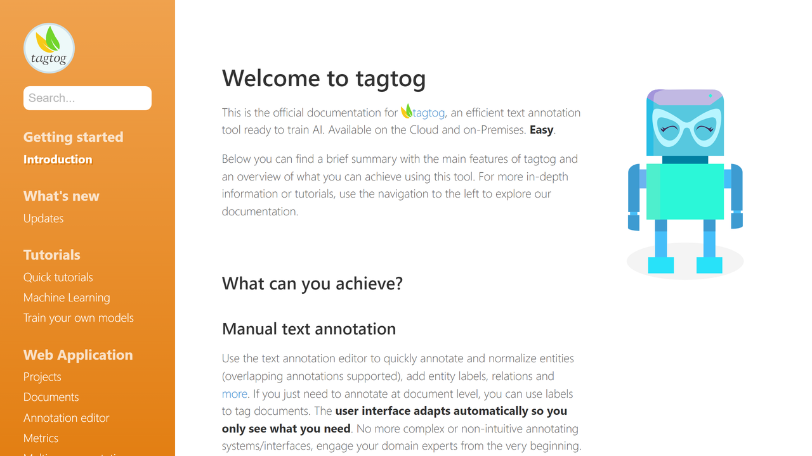

# TagTog

TagTog is a collaborative text annotation platform designed to efficiently create, manage, and maintain high-quality datasets for natural language processing (NLP) and machine learning applications.

## Overview

TagTog provides a comprehensive text annotation solution that enables organizations to transform unstructured text into structured, annotated datasets for training AI models. Their platform combines manual annotation capabilities with machine learning assistance to streamline the data preparation process for NLP applications.

The TagTog platform is distinguished by its focus on efficiency and collaboration in the text annotation workflow. Their technology leverages machine learning to assist annotators, continuously improving accuracy and reducing manual effort as more annotations are created [[1]](https://docs.tagtog.com/). The platform has gained particular recognition in the biomedical and scientific domains, where it has been used to annotate gene mentions and other specialized entities in research publications [[2]](https://pmc.ncbi.nlm.nih.gov/articles/PMC3978375/).

TagTog serves organizations and research teams developing NLP applications, particularly those requiring domain-specific annotations such as in healthcare, life sciences, and other specialized fields. Their platform is designed to support both small-scale research projects and large-scale annotation initiatives requiring multiple annotators and complex annotation schemas.

## Key Features

- **Collaborative Annotation**: Multi-user annotation environment with role-based access control
- **Machine Learning Assistance**: AI-powered pre-annotation and continuous learning
- **Entity Recognition**: Named entity annotation with customizable entity types
- **Relationship Annotation**: Capturing connections between entities in text
- **Document Classification**: Categorization of documents into defined classes
- **Annotation Guidelines**: Integrated documentation for annotation standards
- **Quality Management**: Inter-annotator agreement metrics and review workflows
- **Import/Export Capabilities**: Support for various document formats and annotation standards
- **API Access**: Programmatic integration with existing workflows
- **Deployment Options**: Available as cloud service or on-premises installation

## Use Cases

### Biomedical Entity Recognition

Research institutions and pharmaceutical companies implement TagTog to create annotated corpora of biomedical literature. Researchers define custom entity types relevant to their domain, such as genes, proteins, diseases, drugs, and biological processes. Annotators highlight mentions of these entities throughout scientific publications and clinical texts. TagTog's machine learning capabilities assist by suggesting similar entity mentions based on previously annotated examples. Inter-annotator agreement features help maintain consistency across multiple annotators working on the same dataset. The completed annotations can be exported in standard formats for training custom named entity recognition models. This implementation accelerates biomedical knowledge extraction through automated entity identification, improves research efficiency through faster literature review, enables novel discoveries through relationship mapping between biological entities, and enhances regulatory compliance through standardized information extraction from documents.

### Clinical Document Processing

Healthcare organizations utilize TagTog to develop and train systems for processing clinical documentation. The platform enables annotation of clinical concepts such as symptoms, diagnoses, medications, procedures, and medical measurements within electronic health records and clinical notes. Document classification features allow categorization of clinical documents by type, department, or priority. Relationship annotation captures connections between clinical concepts, such as drug-drug interactions or symptom-disease associations. Privacy features ensure sensitive patient information is handled according to regulatory requirements. The resulting annotated datasets train models that extract structured information from unstructured clinical text. This approach enhances patient care through more comprehensive information access, improves clinical decision support through structured data extraction, reduces administrative burden through automated documentation processing, and supports research through standardized medical concept extraction.

### Multilingual Content Analysis

Global organizations implement TagTog to build language processing capabilities across multiple languages. The platform supports annotation of text in various languages, allowing organizations to create parallel annotated datasets. Teams define consistent annotation schemas that work across language boundaries, ensuring conceptual alignment. Language-specific annotation guidelines help annotators address unique linguistic features while maintaining cross-language consistency. Machine learning assistance adapts to each language's patterns, accelerating the annotation process. The resulting multilingual datasets enable training of cross-language information extraction systems and translation aids. This implementation enhances global operations through consistent information processing across languages, improves international customer service through multilingual content understanding, facilitates market research through standardized cross-market analysis, and enables knowledge transfer between language-specific content repositories.

## Technical Specifications

| Feature | Specification |
|---------|---------------|
| Deployment Options | Cloud-hosted SaaS, On-premises installation |
| Browser Support | Modern web browsers (Chrome, Firefox, Safari) |
| User Management | Role-based access control, team collaboration |
| Document Formats | PDF, TXT, XML, JSON, and others |
| Annotation Types | Entities, relationships, document labels, normalization |
| Machine Learning | Active learning, pre-annotation, annotation suggestions |
| API | RESTful API for integration and automation |
| Security | Encryption, access controls, data protection |
| Scalability | Support for large document collections |
| Export Formats | JSON, XML, standoff format, custom formats |

## Getting Started

1. **Project Setup**: Define annotation schema and entity types
2. **Document Import**: Upload and organize documents for annotation
3. **Team Configuration**: Set up users, roles, and guidelines
4. **Annotation Process**: Perform manual and machine-assisted annotation
5. **Quality Assurance**: Review annotations and measure agreement
6. **Data Export**: Export annotated data for model training

## Resources

- [TagTog Documentation](https://docs.tagtog.com/)
